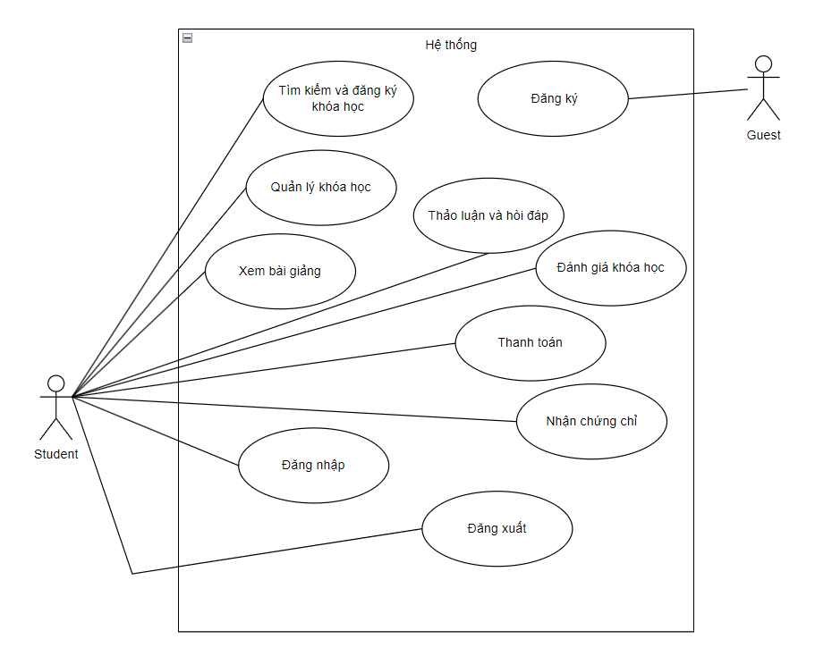

# Mô tả usecase và hình giao diện

## Use case

## 1. Guest (Khách vãng lai)

### 1.1. Đăng ký tài khoản (\*)

- **Mô tả:** Khách vãng lai có thể tạo tài khoản để trở thành học viên. Quá trình đăng ký yêu cầu cung cấp thông tin cá nhân và xác thực qua email.
- **Mục đích:** Tạo điều kiện cho người dùng mới có thể truy cập và sử dụng các chức năng đầy đủ của hệ thống học tập.
- **Giao diện Đăng ký tài khoản:**

## 2. Student (Học viên)

### 2.1. Đăng nhập (\*)

- **Mô tả:** Học viên đăng nhập vào hệ thống bằng tài khoản đã đăng ký. Sau khi đăng nhập, học viên có thể chỉnh sửa thông tin cá nhân như tên, email, số điện thoại, mật khẩu.
- **Mục đích:** Cho phép học viên truy cập vào hệ thống và cập nhật thông tin cá nhân của mình.
- **Giao diện Đăng nhập:**

### 2.2. Tìm kiếm & đăng ký khóa học (\*)

- **Mô tả:** Học viên có thể tìm kiếm khóa học bằng cách sử dụng danh mục khóa học hoặc từ khóa tìm kiếm. Sau khi tìm được khóa học phù hợp, học viên có thể đăng ký tham gia.
- **Mục đích:** Hỗ trợ học viên trong việc tìm kiếm và đăng ký các khóa học họ quan tâm.
- **Giao diện Đăng ký khóa học:**

### 2.3. Quản lý khóa học (\*)

- **Mô tả:** Học viên có thể xem danh sách các khóa học đã đăng ký, theo dõi tiến độ học tập và tình trạng hoàn thành của từng khóa học.
- **Mục đích:** Giúp học viên quản lý và theo dõi quá trình học tập của mình.
- **Giao diện Quản lý khóa học:**

### 2.4. Xem bài giảng (\*)

- **Mô tả:** Học viên truy cập vào các bài giảng đã đăng ký, bao gồm video, tài liệu học và có thể làm các bài kiểm tra trực tuyến.
- **Mục đích:** Cung cấp nội dung học tập và kiểm tra cho học viên trong các khóa học.
- **Giao diện Xem bài giảng:**

### 2.5. Thảo luận & hỏi đáp (\*)

- **Mô tả:** Học viên tham gia các diễn đàn, nhóm thảo luận trong mỗi khóa học để đặt câu hỏi, thảo luận và nhận phản hồi từ giảng viên hoặc các học viên khác.
- **Mục đích:** Tạo môi trường học tập cộng đồng, giúp học viên dễ dàng trao đổi kiến thức.
- **Giao diện Thảo luận:**

### 2.6. Đánh giá khóa học

- **Mô tả:** Học viên để lại đánh giá, phản hồi về chất lượng khóa học sau khi hoàn thành.
- **Mục đích:** Giúp cải thiện chất lượng khóa học dựa trên phản hồi của học viên.
- **Giao diện Đánh giá khóa học:**

### 2.7. Nhận chứng chỉ

- **Mô tả:** Sau khi hoàn thành khóa học, học viên có thể nhận chứng chỉ dưới dạng điện tử hoặc in ấn (nếu có).
- **Mục đích:** Chứng nhận kết quả học tập của học viên sau khi hoàn thành khóa học.
- **Giao diện Nhận chứng chỉ:**

### 2.8. Thanh toán (\*)

- **Mô tả:** Học viên có thể quản lý các phương thức thanh toán, xem lịch sử giao dịch và hóa đơn liên quan đến các khóa học đã đăng ký.
- **Mục đích:** Hỗ trợ học viên trong việc thanh toán các khóa học và quản lý thông tin tài chính.
- **Giao diện Thanh toán:**

### 2.9. Nhận thông báo

- **Mô tả:** Học viên sẽ nhận thông báo khi có bài giảng mới, thông báo từ giảng viên qua hệ thống website và email.
- **Mục đích:** Cập nhật thông tin liên quan đến các khóa học mà học viên tham gia.
- **Giao diện Thông báo:**

